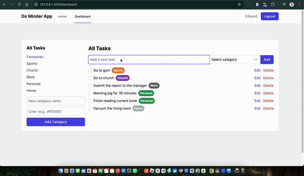

## Sneak Peek



# TaskMaster Pro

>TaskMaster Pro is a powerful task management application designed to help individuals and teams organize, prioritize, and track their tasks efficiently.

## Features

- User authentication and authorization
- Create, edit, and delete tasks
- Organize tasks into projects and categories
- Set due dates and priority levels
- Collaborative task sharing and assignment
- Real-time updates and notifications
- Search and filter tasks
- Generate reports and analytics

## Technologies Used

- Ruby on Rails 7.0.4
- PostgreSQL 14
- Tailwind
- Framer Motion
- JavaScript

## Getting Started

### Prerequisites

- Ruby 3.1.2
- Rails 7.0.4
- Node.js 16+
- PostgreSQL 14

### Run

```
To get a clone of the project, run `https://github.com/odhiambo-ed/rails-do-minder.git`
```

```
cd /rails-do-minder
```

```
bundle install
```

```
rails db:reset
```

```
bin/dev
```


## Author(s)

  <a href="https://github.com/odhiambo-ed" target="blank"></a>   **Edward Odhiambo**

- GitHub: [@whit3d](https://github.com/odhiambo-ed)
- Twitter: [@odhiambo_ed](https://twitter.com/odhiambo_ed)
- LinkedIn: [Edward Odhiambo](https://www.linkedin.com/in/edward-odhiambo/)
- Portfolio: [Edward Odhiambo](https://edwardodhiambo.com/)

## 🤝 Contributing

Contributions, issues, and feature requests are welcome!!!

Feel free to check the [issues page](https://github.com/odhiambo-ed/rails-do-minder/issues)

## Show your support

Give a ⭐️ if you like this project!

## Acknowledgments

- Hat tip to anyone whose code was used
- Special thanks to [Ruby on Rails](https://rubyonrails.org/) for the amazing Ruby framework project. I am grateful for your talent and generosity in sharing your work with the community.

## 📝 License

This project is [MIT](https://github.com/white3d/GitHub-User-Content/blob/main/LICENSE) licensed.

